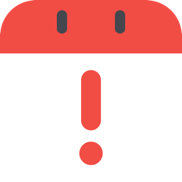

<p align="center">
  
</p>

<h1 align="center">Now What</h1>

A tiny, fast macOS menu bar calendar. No dock icon — it lives in the menu bar and opens a small month calendar with the events for the selected day.

Click the menu bar date to open the calendar. It opens on today, shows the whole month one week per row, and lists the selected day's events below. Navigate months with the arrows, pick a year from the dropdown, and click any day to see what's on it.

> Requires **macOS 14 (Sonoma) or later**.

## Features

- **Month calendar** — full month, one week per row; navigate months with `‹ ›` and pick the year from a dropdown. Days outside the month are greyed out; click the month name to jump back to today.
- **macOS Calendar integration** — shows the selected day's events in a scrollable list via EventKit, and marks days that have events with a dot. No notifications, no account.
- **Today by default** — opens focused on today; click a day to see its events.
- **Settings**:
  - Launch at login.
  - Day the week starts on (default: Monday).
  - Remember the last selected day, or reset to today when opened (default: reset).
  - Translucent background.
  - Grey out weekend days (default: off).
  - Show which days have events (default: on).
  - Highlight holidays from your macOS Holidays calendar (default: off).
  - Hide today's past events (default: on).
  - **Check for Updates**.
- **Lightweight** — native Swift + SwiftUI/AppKit.

## Install

1. Download `NowWhat.zip` from the [latest release](https://github.com/Polmonite/NowWhat/releases/latest).
2. Unzip and drag **Now What.app** into `/Applications`.
3. Launch it. A calendar icon showing today's date appears in your menu bar. The first time you open the events list, click **Connect to Calendar** and grant access.

### "Apple could not verify Now What is free of malware"

This build is **not notarized** (that requires a paid Apple Developer account), so Gatekeeper warns on first launch. To open it anyway (only needed once per version):

- **Right-click** `Now What.app` → **Open** → **Open** in the dialog, **or**
- Open it once, then go to **System Settings → Privacy & Security**, scroll down, and click **Open Anyway**.

Alternatively, strip the quarantine flag in Terminal:

```sh
xattr -dr com.apple.quarantine "/Applications/Now What.app"
```

## Build from source

Requires the Swift toolchain (Command Line Tools: `xcode-select --install`).

```sh
./build.sh --release --run
```

`build.sh` compiles via Swift Package Manager, generates the app icon, assembles `Now What.app`, and ad-hoc signs it (needed so calendar access and launch-at-login work).

## Updates

Settings → **Check for Updates** queries the GitHub Releases page and tells you when a newer version exists. No telemetry, no account — just a single request to the public GitHub API.

## License

[MIT](LICENSE)
